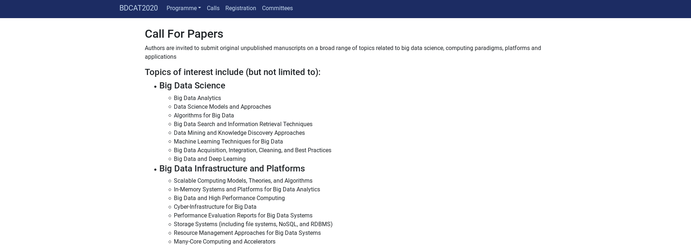

# BDCAT 2020 Webpage

Static set of web pages making use of [Bootstrap](https://getbootstrap.com/) and [particles.js](https://github.com/VincentGarreau/particles.js/).

- main.go: web server for testing and generating pages
- Dockerfile: container build description
- __html/__: contains generated static pages
- __static/__: css, images and javascript dependencies
- __templates/__: go templates used for generating the static pages

# Screenshots




# Local Usage

To run the webserver locally you will require golang to be present on the system.
To start the service:

```
~$ go run main.go

Starting webserver on http://localhost:8080
```

To print out html output to stdout or into a particular "output" folder:

```
~$ go run main.go -r

~$ go run main.go -r -o "output"
```

# Docker

For convenience a Dockerfile is provided that can be used to build and run the service from the container.

```
~$ docker build -t server:test -f Dockerfile .

~$ docker run --rm --host network server:test

Starting webserver on http://localhost:8080
```

Use help option to pass hostname and port to bind to:

```
~$ docker run --rm --host network server:test -h myhost -p 8765

Starting webserver on http://myhost:8765
```
